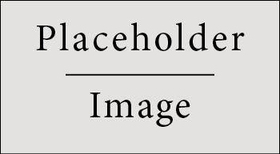

# Abstract
::: {.callout-tip collapse="true"}
  A paper should be about _**one** idea/problem/question_ (and how you answer it).
  
  An abstract should contain 250 words max and briefly explain:
  
  1. Motivation / teaser
  2. Short background/why topic~paper problem important
  3. Approach chosen/research method
  4. Experimental work (done or planned)
  5. Results obtained (or anticipated)
  6. Conclusion (what to do with the results)
:::

Lorem ipsum dolor sit amet, consectetur adipisicing elit, sed do eiusmod tempor incididunt ut labore et dolore magna aliqua. Ut enim ad minim veniam, quis nostrud exercitation ullamco laboris nisi ut aliquip ex ea commodo consequat. Duis aute irure dolor in reprehenderit in voluptate velit esse cillum dolore eu fugiat nulla pariatur.  
Sed ut perspiciatis unde omnis iste natus error sit voluptatem accusantium doloremque laudantium, totam rem aperiam, eaque ipsa quae ab illo inventore veritatis et quasi architecto beatae vitae dicta sunt explicabo. Nemo enim ipsam voluptatem quia voluptas sit aspernatur aut odit aut fugit, sed quia consequuntur magni dolores eos qui ratione voluptatem sequi nesciunt.


# Introduction
::: {.callout-tip collapse="true"}
Length \~1.5-2 pages max.

1.  Nature of the problem (motivation/teaser)
2.  (short) Background of previous work (or on what this paper builds)
3.  Purpose and significance of the paper (why your work adds to solve the
    problem)
4.  Method by which the problem is approached (what type of paper)
5.  Contribution(s) of the paper (stop using ‘organisation of the paper, i.e.
    section X does x, section Y does y … tell what a reader gets from the paper)
6. Use acronyms like `\acr{ICAO}` to get "\acr{ICAO}"".
7. If needed in paper preparation or production, you can highlight text
   like [this]{colour="#b22222" bg-colour="#abc123"}.
:::

Lorem ipsum dolor sit amet, consectetur adipisicing elit, sed do eiusmod tempor incididunt ut labore et dolore magna aliqua. Ut enim ad minim veniam, quis nostrud exercitation ullamco laboris nisi ut aliquip ex ea commodo consequat. Duis aute irure dolor in reprehenderit in voluptate velit esse cillum dolore eu fugiat nulla pariatur @fig-forecast. Excepteur sint occaecat cupidatat non proident, sunt in culpa qui officia deserunt mollit anim id est laborum.


::: {#fig-forecast}
```{r chunk-name-with-dashes}
#| out-width: "100%"
#| echo: false
#| fig-scap: "Placeholder"

```

A long caption with formula $E = m c^2$.
:::


# Background
::: {.callout-tip collapse="true"}
Length: \~2 pages, 3-4 building blocks, i.e. half a page each.

-   what does a reader need to know to understand the work?
-   Could entail literature review and what you do with the findings from it,
    but also context stuff.
:::

Lorem ipsum dolor sit amet, consectetur adipisicing elit, sed do eiusmod tempor incididunt ut labore et dolore magna aliqua. Ut enim ad minim veniam, quis nostrud exercitation ullamco laboris nisi ut aliquip ex ea commodo consequat [@knuth84]. Duis aute irure dolor in reprehenderit in voluptate velit esse cillum dolore eu fugiat nulla pariatur. Excepteur sint occaecat cupidatat non proident, sunt in culpa qui officia deserunt mollit anim id est laborum.

Sed ut perspiciatis unde omnis iste natus error sit voluptatem accusantium doloremque laudantium, totam rem aperiam, eaque ipsa quae ab illo inventore veritatis et quasi architecto beatae vitae dicta sunt explicabo. Neque porro quisquam est, qui dolorem ipsum quia dolor sit amet, consectetur, adipisci velit, sed quia non numquam eius modi tempora incidunt ut labore et dolore magnam aliquam quaerat voluptatem. Ut enim ad minima veniam, quis nostrum exercitationem ullam corporis suscipit laboriosam, nisi ut aliquid ex ea commodi consequatur? Quis autem vel eum iure reprehenderit qui in ea voluptate velit esse quam nihil molestiae consequatur, vel illum qui dolorem eum fugiat quo voluptas nulla pariatur?


# Materials and methods
::: {.callout-tip collapse="true"}
This could also be named **System model**.\
Length: \~2 pages, 3-4 building blocks, i.e. half a page each.

-   Normally start with the context/system perspective or research “workflow”,
    use a diagram to explain the steps
-   Describe data, source, and/or pre-processing steps
-   (if required) what specific method/algorithm the paper uses/applies, put
    essential math here[^1].

[^1]: if it gets too heavy on the math-side, think about putting this in an
    appendix (unless you submit to a math conference)
:::

Lorem ipsum dolor sit amet, consectetur adipisicing elit, sed do eiusmod tempor incididunt ut labore et dolore magna aliqua @tbl-megaconstellations. Ut enim ad minim veniam, quis nostrud exercitation ullamco laboris nisi ut aliquip ex ea commodo consequat, @eq-ellipse. 
$$
\frac{x^2}{a^2} + \frac{y^2}{b^2} = 1
$$ {#eq-ellipse}

Duis aute irure dolor in reprehenderit in voluptate velit esse cillum dolore eu fugiat nulla pariatur. Excepteur sint occaecat cupidatat non proident, sunt in culpa qui officia deserunt mollit anim id est laborum.


```{r}
#| label: tbl-megaconstellations
#| tbl-cap: Mega-constellations (planned > 1000) as per filing to the \acr{ITU}
#| tbl-cap-location: bottom

library(tibble)
library(gt)

megas <- tibble::tribble(
  ~constellation , ~state , ~launched , ~active , ~planned , ~first_launch ,
  "Starlink"     , "US"   ,      4714 ,    3521 ,     4714 ,          2018 ,
  "Starlink2A"   , "US"   ,      3689 ,    3070 ,     6720 ,          2022 ,
  "Starlink2"    , "US"   ,         0 ,       0 ,    30456 , NA            ,
  "OneWeb"       , "UK"   ,       660 ,     635 ,      716 ,          2019 ,
  "OneWeb2"      , "UK"   ,         0 ,       0 ,     2304 , NA            ,
  "Kuiper"       , "US"   ,        29 ,      27 ,     3232 ,          2023 ,
  "StarShield"   , "US"   ,       193 ,     126 ,       32 ,          2022 ,
  "Xingwang"     , "CN"   ,        50 ,      10 ,      996 ,          2021 ,
  "Qianfan"      , "CN"   ,        90 ,      28 ,       32 ,          2024 ,
  "Guangwang"    , "CN"   ,         0 ,       0 ,    12992 , NA            ,
  "Yinhe"        , "CN"   ,         8 ,       7 ,     1000 ,          2020 ,
  "Hanwha"       , "KR"   ,         0 ,       0 ,     2000 , NA            ,
  "Lynk"         , "US"   ,        10 ,       6 ,     2000 ,          2020 ,
  "Astra"        , "US"   ,         0 ,       0 ,    13620 , NA            ,
  "Telesat"      , "CA"   ,         0 ,       0 ,      300 , NA            ,
  "HVNET"        , "US"   ,         0 ,       0 ,     1440 , NA            ,
  "SpinLaunch"   , "US"   ,         0 ,       0 ,     1190 , NA            ,
  "Globalstar3"  , "DE"   ,         0 ,       0 ,     3080 , NA            ,
  "Honghu-3"     , "CN"   ,         0 ,       0 ,    10000 , NA            ,
  "Semaphore"    , "FR"   ,         0 ,       0 ,   116640 , NA            ,
  "E-Space"      , "US"   ,         4 ,       0 ,   337323 ,          2022
)

# ~constellation, ~state, ~launched, ~active, ~planned, ~first_launch,
megas |>
  gt() |>
  cols_label(
    constellation ~ "Constellation",
    state ~ "Country",
    launched ~ "Launched",
    active ~ "Active",
    planned ~ "Planned",
    first_launch ~ "First launch"
  ) |>
  sub_missing(
    columns = "first_launch",
    missing_text = "-"
  ) |>
  opt_table_font(size = "10px")

```


## Results
::: {.callout-tip collapse="true"}
Length: \~2 pages, 3-4 building blocks, i.e. half a page each.

-   Design the paper to have about 3-4 sub-sections of results to address the
    findings and hammer home the argument/solution evidence
-   Describe results and then discuss!
-   Check for meaningful visualisations and use annotation to highlight what
    your text marks as finding/discussion point.\
    Make sure each figure/table is referenced (minimum once) in the text.
:::

At vero eos et accusamus et iusto odio dignissimos ducimus qui blanditiis praesentium voluptatum deleniti atque corrupti quos dolores et quas molestias excepturi sint occaecati cupiditate non provident, similique sunt in culpa qui officia deserunt mollitia animi, id est laborum et dolorum fuga. Et harum quidem rerum facilis est et expedita distinctio. Nam libero tempore, cum soluta nobis est eligendi optio cumque nihil impedit quo minus id quod maxime placeat facere possimus, omnis voluptas assumenda est, omnis dolor repellendus. Temporibus autem quibusdam et aut officiis debitis aut rerum necessitatibus saepe eveniet ut et voluptates repudiandae sint et molestiae non recusandae. Itaque earum rerum hic tenetur a sapiente delectus, ut aut reiciendis voluptatibus maiores alias consequatur aut perferendis doloribus asperiores repellat.


# Conclusions
::: {.callout-tip collapse="true"}

Length: 1 page, each point minimum 1 paragraph, possibly including references.

1.  What is shown by the paper and its significance
2.  Limitations and advantages
3.  Application of the results
4.  Recommendation for future/further work
5.  (Potential use/benefit for others, the world, …)
:::

Ut enim ad minima veniam, quis nostrum exercitationem ullam corporis suscipit laboriosam, nisi ut aliquid ex ea commodi consequatur? Quis autem vel eum iure reprehenderit qui in ea voluptate velit esse quam nihil molestiae consequatur, vel illum qui dolorem eum fugiat quo voluptas nulla pariatur?

Nam libero tempore, cum soluta nobis est eligendi optio cumque nihil impedit quo minus id quod maxime placeat facere possimus, omnis voluptas assumenda est, omnis dolor repellendus. Temporibus autem quibusdam et aut officiis debitis aut rerum necessitatibus saepe eveniet ut et voluptates repudiandae sint et molestiae non recusandae.


# Acknowledgment
::: {.callout-tip collapse="true"}
If appropriate
:::

Neque porro quisquam est, qui dolorem ipsum quia dolor sit amet, consectetur, adipisci velit, sed quia non numquam eius modi tempora incidunt ut labore et dolore magnam aliquam quaerat voluptatem. 
Et harum quidem rerum facilis est et expedita distinctio. Nam libero tempore, cum soluta nobis est eligendi optio cumque nihil impedit quo minus id quod maxime placeat facere possimus, omnis voluptas assumenda est, omnis dolor repellendus.


# Appendices
::: {.callout-tip collapse="true"}
If appropriate
:::

Excepteur sint occaecat cupidatat non proident, sunt in culpa qui officia deserunt mollit anim id est laborum.  
Duis aute irure dolor in reprehenderit in voluptate velit esse cillum dolore eu fugiat nulla pariatur.  
Ut enim ad minima veniam, quis nostrum exercitationem ullam corporis suscipit laboriosam, nisi ut aliquid ex ea commodi consequatur?  
Et harum quidem rerum facilis est et expedita distinctio. Itaque earum rerum hic tenetur a sapiente delectus, ut aut reiciendis voluptatibus maiores alias consequatur aut perferendis doloribus asperiores repellat.

# References {.unnumbered}
::: {.callout-tip collapse="true"}
Make sure to turn a paper not into a journal article or thesis … if there are
more than 15 references think about whether the paper tackles “1” relevant
problem … unless it is a literature review discussion 😉.
:::

::: {#refs}
:::
